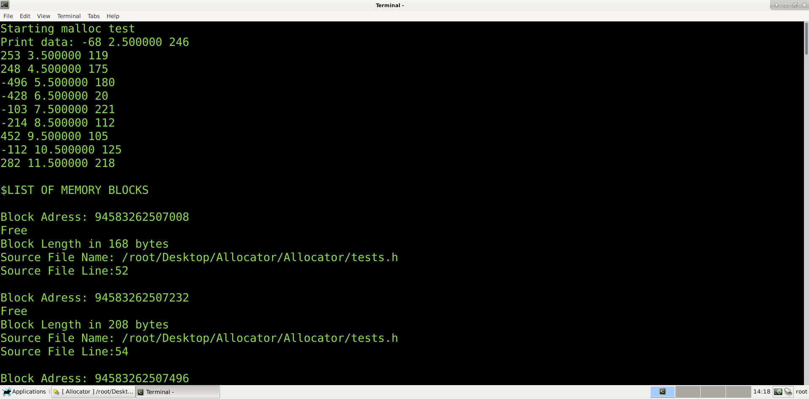
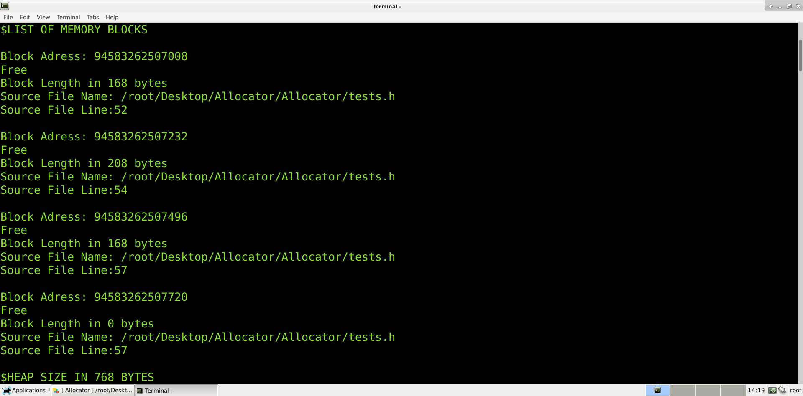
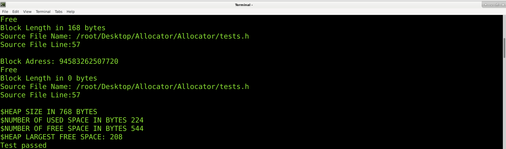
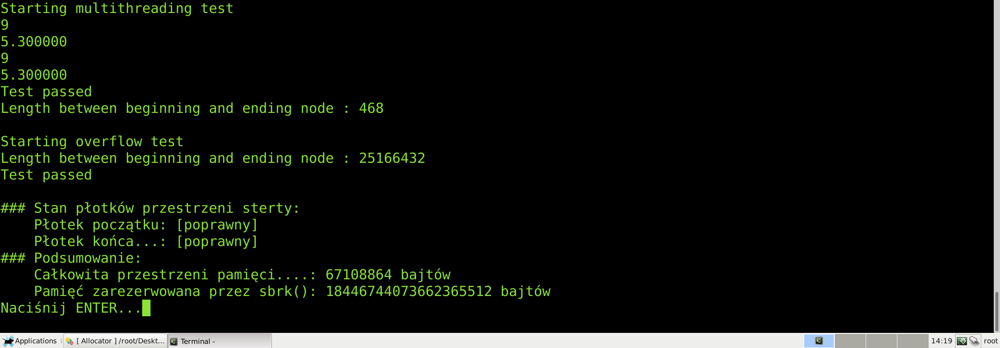

# Memory allocator
  I wrote a memory allocator as a project for my subject called operating systems
## Acquired knowledge
  * Improved my skills with pointers
  * Got more information about the process of memory allocation
  * Created some important tests to check my program
  * Got the basics of using brk and dynamic allocation
### Sample images showing tests

